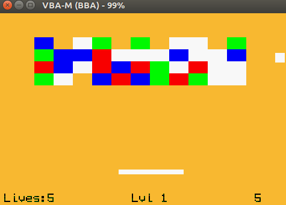

# Breakout

A simple game created for CS 2110.

## Instructions
To start the game, enter 
```
make vba
``` 
into the terminal.

Use the arrow keys to move the paddle. Bounce
the ball off the paddle to hit the blocks on
the screen. Once all the blocks are gone, you
will move onto the next level.

The ball moves faster every level. Be careful
not to let the ball fall to the bottom of the
screen, or you'll lose a life! You start with
7 lives. Lose them all, and it's game over.

If you can make it past LVL 2, then you win!
Take a screen shot of your victory, and show
it to your friends. They'll be so jealous of
your mad skills.

## Controls
```
START = new game

SELECT = return to title screen

UP/DOWN/LEFT/RIGHT = move paddle
```

## Gameplay
 
